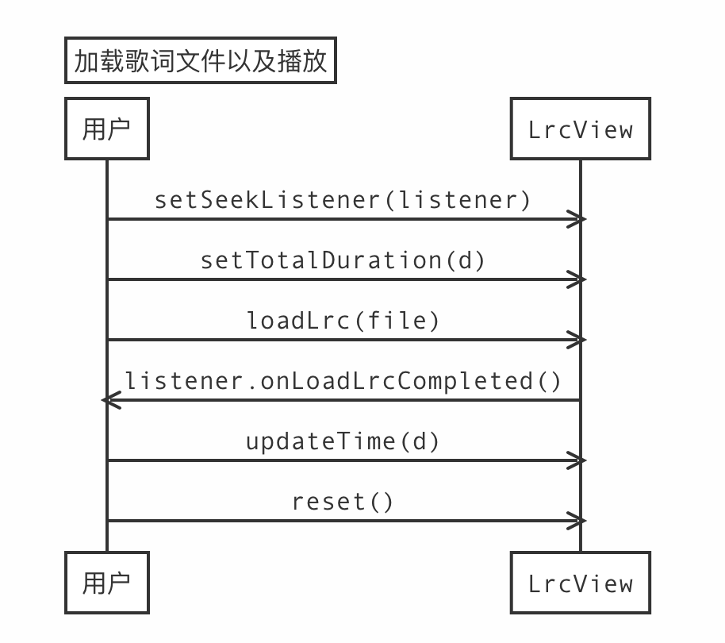

# 歌词控件 LyricsView
主要负责歌词的显示，支持上下拖动调整进度。

## 引入 LyricsView 控件

### 源代码模式

参考如下步骤，在主播端和观众端添加 LyricsView 控件：

将该模块整体目录 `lrcview` 文件夹拷贝至你的项目文件夹下。

在你的项目中引入 `lrcview` 控件。

打开项目的 `settings.gradle` 文件，添加如下代码：
```
include ':lrcview'
```
在你的项目中添加 `lrcview` 控件的依赖项。打开项目的 `app/build.gradle` 文件，添加如下代码：
```
dependencies {
    ...
    implementation project(':lrcview')
}
```

### JitPack 方式

```
allprojects {
    repositories {
        ...
        maven { url 'https://jitpack.io' }
    }
}
```

```
dependencies {
    ...
    implementation 'com.github.AgoraIO-Community:LyricsView:1.0.31'
}
```

## xml 中使用
```
<io.agora.lyrics_view.LrcView
    android:id="@+id/lrc_view"
    android:layout_width="match_parent"
    android:layout_height="match_parent"
    android:paddingStart="10dp"
    android:paddingTop="20dp"
    android:paddingEnd="10dp"
    android:paddingBottom="20dp"
    app:lrcCurrentTextColor="@color/ktv_lrc_highlight"
    app:lrcDividerHeight="20dp"
    app:lrcLabel=" "
    app:lrcNormalTextColor="@color/ktv_lrc_normal"
    app:lrcNormalTextSize="16sp"
    app:lrcTextGravity="center"
    app:lrcTextSize="26sp" />
```

| xml 参数              |说明|代码|
|---------------------|----|----|
| lrcCurrentTextColor |歌词高亮下颜色|setCurrentColor|
| lrcNormalTextColor  |歌词正常下颜色|setNormalColor|
| lrcTextSize         |文字高亮下大小|setCurrentTextSize|
| lrcNormalTextSize   |文字正常下大小|setNormalTextSize|
| lrcLabel            |没有歌词下默认文字|setLabel|
| lrcTextGravity      |歌词对齐方式|无|
| lrcDividerHeight    |歌词上下之间间距|无|

## 主要 API
|API| 说明                           |
|----|------------------------------|
|setSeekListener| 绑定歌词拖动事件回调，用于接收拖动事件中状态或者事件回调 |
|setSingScoreListener| 绑定唱歌打分事件回调，用于接收唱歌过程中事件回调 |
|setTotalDuration| 设置音乐总长度，单位毫秒                 |
|loadLrc| 加载本地歌词文件                     |
|setEnableDrag| 设置是否允许上下滑动                   |
|updateTime| 更新进度，单位毫秒                    |
|hasLrc| 是否有歌词文件                      |
|reset| 重置内部状态，清空已经加载的歌词             |

## 使用流程

